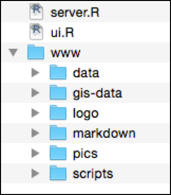

# CNM Outbreak Detection Tool

The CNM Outbreak Detection Tool can be launched directly from the App folder. Simply navigate through the folder and double click on the file: “_DOUBLE CLICK TO LAUNCH APP”
The App has been tested on Windows 7, 8.1 and 8.2 (x64 architecture) with Chrome browser.

## Intoduction

The main purpose of the malaria Outbreak Detection Tool (ODT) is to help analyse epidemiological trends in Cambodia and to detect unusual increases in the number of malaria cases at the Provincial, Operational District (OD) and Health Facility level. 

## ODT Framework

The ODT is built on the R/Shiny platform. R Statistical Software, often simply called ‘R’ is a free software environment for statistical computing and graphics. Shiny is an open source R package that provides an elegant and powerful web framework for building web applications using R.  In addition to these, additional R libraries are used to produce maps and tables that are integrated to the Shiny App.
All solutions used are open-source, free software and can be obtained in the listed websites:

- R Core Team (2014). R: A language and environment for statistical computing. R Foundation for Statistical Computing, Vienna, Austria. http://www.R-project.org/.
- Winston Chang (2015). Shiny: Web Application Framework for R. R package version 0.11. http://CRAN.R-project.org/package=shiny
- Leaflet, a JavaScript library for interactive maps: http://leafletjs.com 
- Datable table plug-in for jQuery: https://www.datatables.net/
- H. Wickham. ggplot2: elegant graphics for data analysis. Springer New York, 2009: http://ggplot2.org 

## ODT Application Format

he ODT, as any other shiny application, is essentially built using two R scripts that communicate with each other: a user interface script (ui.R), which controls the layout and appearance of the application; and a server script (server.R), incorporating instructions for user input, processing data, and output by utilizing the R language and functions from user installed packages. In addition to these scripts, the ODT also comprises a folder (www) with data and additional elements required for the application to run.

The application folder contains the following elements:

- server.R is the  Shiny server R script.
- ui.R is the Shiny user interface R script.
- www folder with the followings sub-folders:
    - logo contains CNM and Malaria Consortium logos.
    - gis-data contains a shapefile of the Cambodian provinces.
    - scripts contains several R scripts.
    - pics contains images displayed in the About tab.
    - data contains the 3 data files used in the ODT: Tier_OD.csv, HIS_Data.xlsx and VMW_Data.xlsx.
    - markdown contains the password.md with the text displayed in the Password Tab as well as about.md with the text displayed in the About tab.

 
Figure 1: Content of the ODT folder.